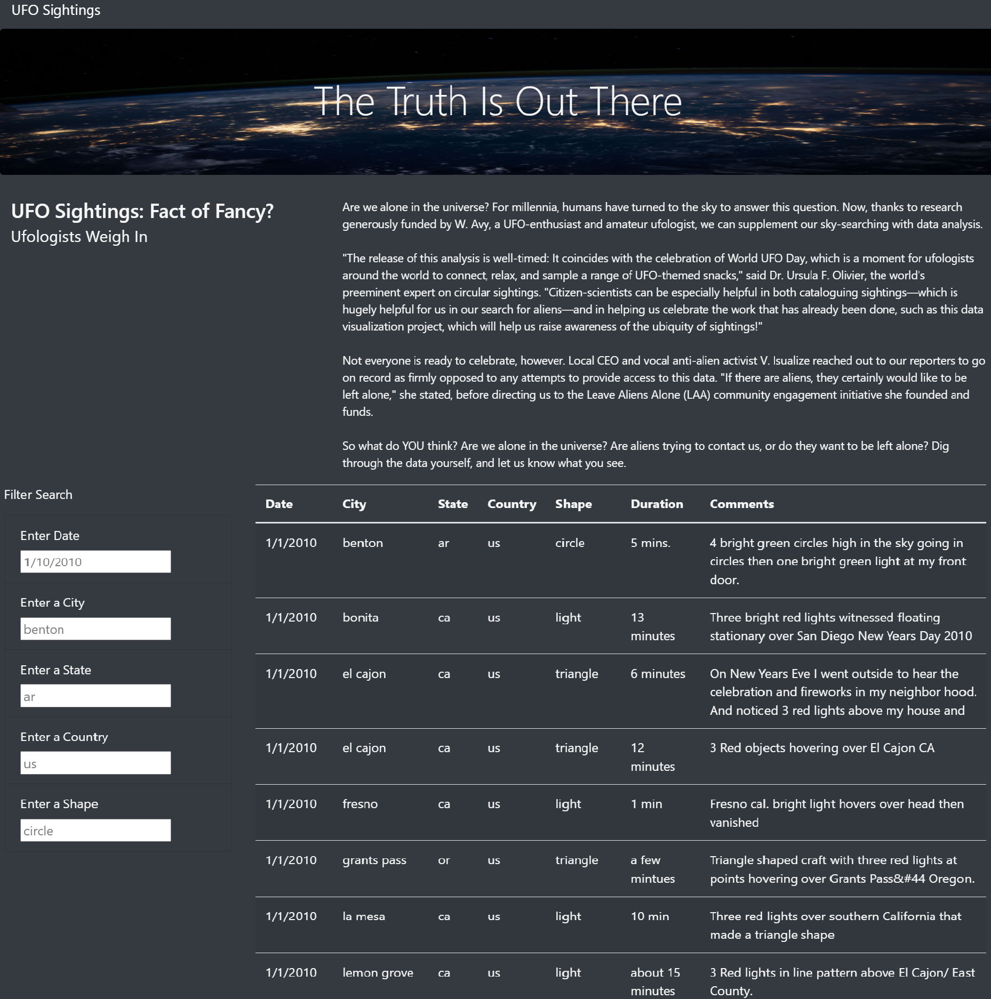
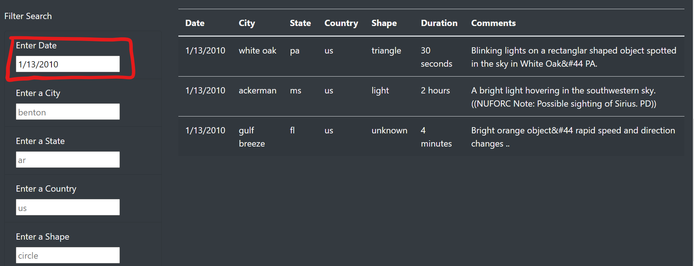
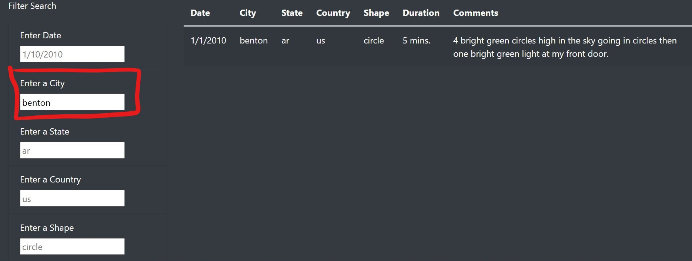
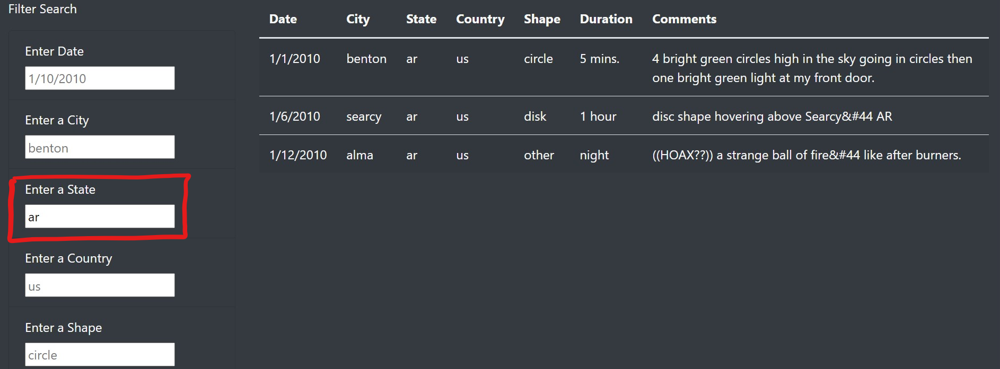
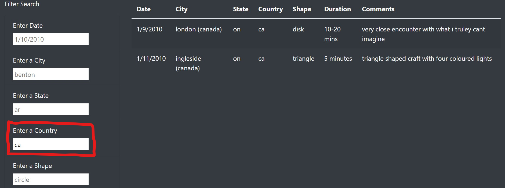
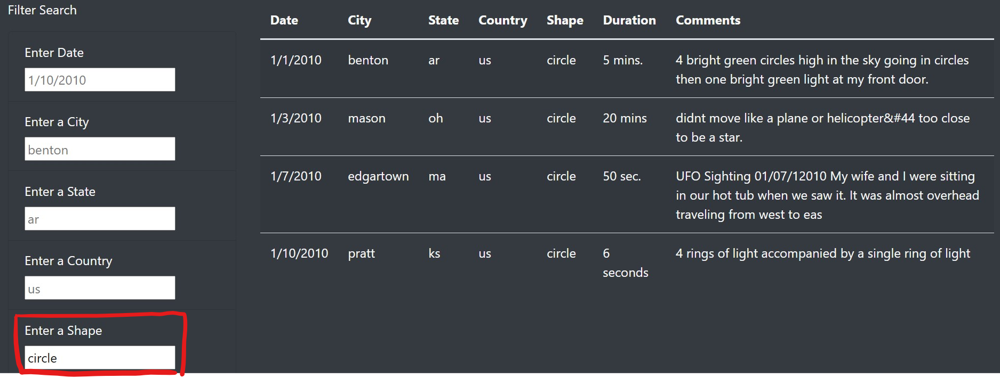
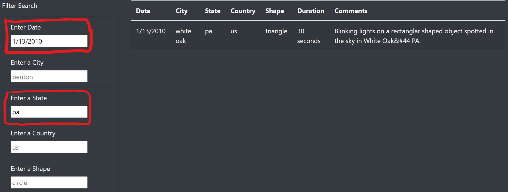

# UFOs

## Project Overview

Dana is a data journalist who is at a point in her career where she has the freedom to choose the topics she wants to write about. When she was given the opportunity to write about her hometown McMinnville Oregon, she jumps on it for a couple of reasons. First, it’s an opportunity to revisit the memories and people back home. But second and the really fun part is the topic UFOs. McMinnville is famous for its sightings and even had an annual gathering of UFO enthusiasts. It’s a topic that Dana has been interested in since she was a child. She first heard about farmer Trent’s sighting back in 1950. For this assignment, the only thing she has to go on so far in a JavaScript file filled to the brim with sighting information. Dana is aware of JavaScript’s visual functionality. She wants to first use JavaScript to display the data as a table. Also, she wants to provide a way to manipulate the data by adding filters using JavaScript. Additionally, she wants to post her article online to put everything together in a tidy HTML page. 

The propose of this project is to help Dana to create an HTML page that contains Dana's article, the table of data to support her findings, and easy to use filters to fine-tune the results. Also, JavaScript will be used to display the data as a table and provide a way for users to manipulate the data by adding filters. 

## Result
### Process of using the search criteria

Web Application Overview: 

### User can filter data using a single filter

> Date Filter 
> - Date Filter Format: "MM/DD/YYYY"
> - For Example: Data filtered by "1/13/2010" (See Image below)

> City Filter 
> - City Filter Format: City name (All lower case letters)
> - For Example: Data filtered by "benton" (See Image below)

> State Filter 
> - State Filter Format: State abbrevission (All lower case letters)
> - For Example: Data filtered by "ar" (See Image below)

> Country Filter 
> - Country Filter Format: Country abbrevission (All lower case letters)
> - For Example: Data filtered by "ca" (See Image below)

> Shape Filter 
> - Shape Filter Format: Shape (All lower case letters)
> - For Example: Data filtered by "circle" (See Image below)

### User can filter data using multiple filters
> For Example: Data filtered by Date and State
> 1. Set Enter Date as "1/13/2010" 
Data gets filtered by date entered (See Image below)

> 2. Set Enter a State as "pa"
Data gets filtered by state entered (See Image below)

Note: Data gets filtered by Date than State. The order of the filter does not affect the result.

### Clear Filter(s) 
>1. Clear the filter data
>2. Enter 

## Summary
One of the drawbacks of this new design is that users need to know the exact abbreviation to filter. For Example, Users need to enter the date into the "Enter Date" Filter in a specific format, cannot enter just the year. Also, Users cannot enter c in the "Enter a State" Filter, need to enter ca.

Here are two recommendations for further development:
- Change filters to search for a partial match on input instead of an exact match. 
- Add filters Duration and Description with the ability to search on a partial match. 
- Add the "Clear Filters" button with function to clear filter input fields and return original data. 
